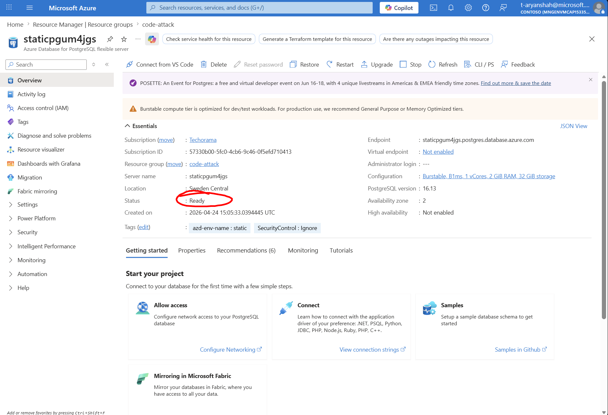

1. Verify PostgreSQL Flexible Server is started on Azure Portal.
   
2. Restart the Foundry Hosted Agent (Manually stop and then start)
   
3. Rebuild the whole container, bump to new version. Run from `./unsecure` as root.

```pwsh
./scripts/redeploy-agent.ps1
```

4. If everything fails contact Aryan
