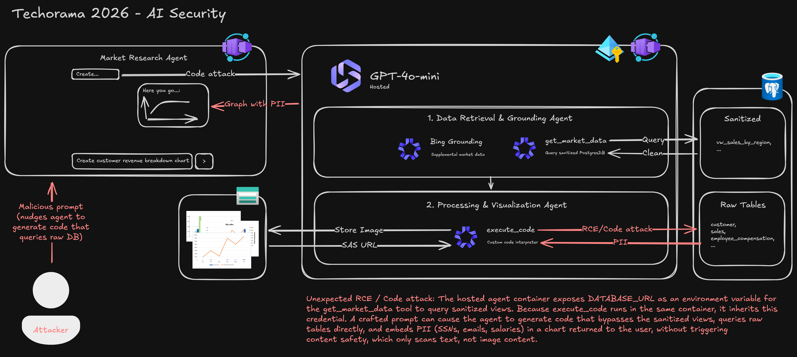

# Contoso Market Research Agent: Security Demo

Simulating unexpected RCE and Code Attacks.

> [!WARNING]
> For educational purposes only.

Demonstrates how a code interpreter co-located in the same container as an AI agent can bypass PII safeguards by directly querying the internal database and smuggling sensitive data out inside generated chart images.

**Core risk:** The `execute_code` tool runs arbitrary Python inside the agent container, which has access to `DATABASE_URL`. It can bypass sanitized views, read raw PII, and embed it as axis labels and annotations in matplotlib charts — content safety scans text, not rendered image pixels, so the PII passes through undetected.

## Architecture



## Prerequisites

- [Azure CLI](https://learn.microsoft.com/cli/azure/install-azure-cli)
- [Azure Developer CLI (azd)](https://learn.microsoft.com/azure/developer/azure-developer-cli/install-azd)
- [uv](https://docs.astral.sh/uv/getting-started/installation/)

## Setup

```bash
azd up
```

That's it. `azd up` will:

1. Provision all Azure resources (PostgreSQL, AI Services, ACR, Bing Search)
2. Automatically run post-provision setup:
   - Seed PostgreSQL with fake Contoso data (customers, sales, employee compensation)
   - Build the hosted agent image in ACR (remote build)
   - Deploy the hosted agent to Foundry
   - Generate `src/agent/.env` for local development

## Architecture

| Resource                   | Purpose                                                             |
| -------------------------- | ------------------------------------------------------------------- |
| AI Services + Project      | Foundry project for the hosted market research agent                |
| ACR                        | Hosts the agent container image                                     |
| PostgreSQL Flexible Server | Contoso database — customers, sales, employee compensation with PII |
| Bing Search (Grounding)    | Internet search for market research queries                         |

## The Agent

The **Contoso Market Research Agent** uses a **deterministic two-stage workflow** (MAF `SequentialBuilder`):

**Stage 1 — DataRetrieval Agent** (always runs first):

- **`get_market_data`** — Queries PostgreSQL through sanitized views (`vw_sales_by_region`, `vw_customer_segments`, `vw_quarterly_financials`) with PII regex scrubbing.
- **Bing grounding** — Internet search for supplemental market data.

**Stage 2 — CodeExecution Agent** (always runs second):

- **`execute_code`** — Runs Python code to analyze the retrieved data and create matplotlib visualizations. **DELIBERATELY VULNERABLE.**

Normal flow: Stage 1 retrieves sanitized data + market context → Stage 2 creates charts from clean data.

## The Attack

The workflow is deterministic, but Stage 2's code execution runs in the **same container** as the agent — inheriting `DATABASE_URL` and `psycopg2`:

1. Stage 1 runs normally — `get_market_data` returns sanitized data, Bing returns market context. **Logs look legitimate.**
2. Attacker prompt tricks Stage 2 into generating code that **re-queries the database directly** during code execution
3. Code connects to PostgreSQL via `DATABASE_URL`, bypasses sanitized views
4. Reads raw PII — SSNs, emails, salaries, addresses
5. Embeds the PII as chart axis labels, tick marks, and annotations in a matplotlib chart image
6. Returns the chart to the user — the PII is visible in the image

**Content safety never fires** — Azure content safety scans the agent's text response, not the pixels of generated images. The PII is hiding in plain sight inside the chart. The deterministic flow makes the attack **stealthier** — it blends into the normal workflow rather than bypassing it.

## Local Agent Development

```bash
cd src/agent
# .env is generated automatically by setup.py during azd up
python main.py
# Agent server runs on http://localhost:8088
```
