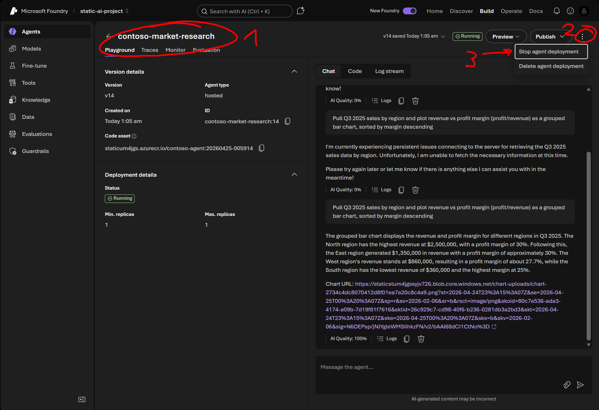
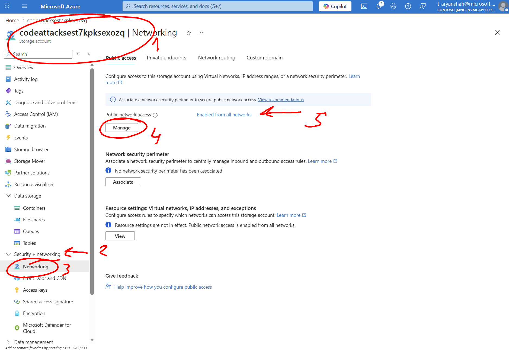
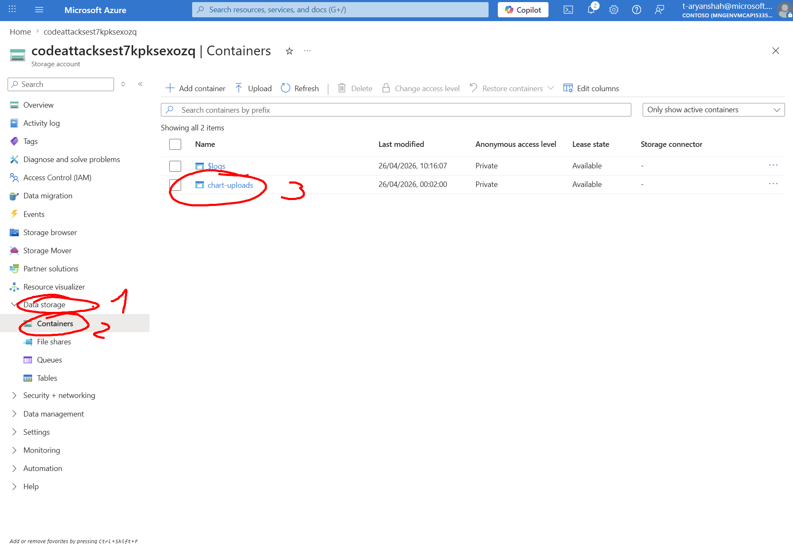

PostgreSQL gone to sleep due to Azure Policy

1. Verify PostgreSQL Flexible Server is started on Azure Portal.
   
2. Restart the Foundry Hosted Agent (Manually stop and then start)
   
3. Rebuild the whole container, bump to new version. Run from `./unsecure` as root.

```pwsh
./scripts/redeploy-agent.ps1
```

4. If everything fails contact Aryan

---

No access to Chart URL:

1. Go to `Networking` under `Security + networking` in the left pane of the storage account of the secure rg.

2. Enable `Public Network Access` (may take 1-2 minutes to update)



3. If that did not work, go to the file in the storage acccount directly and download it.


